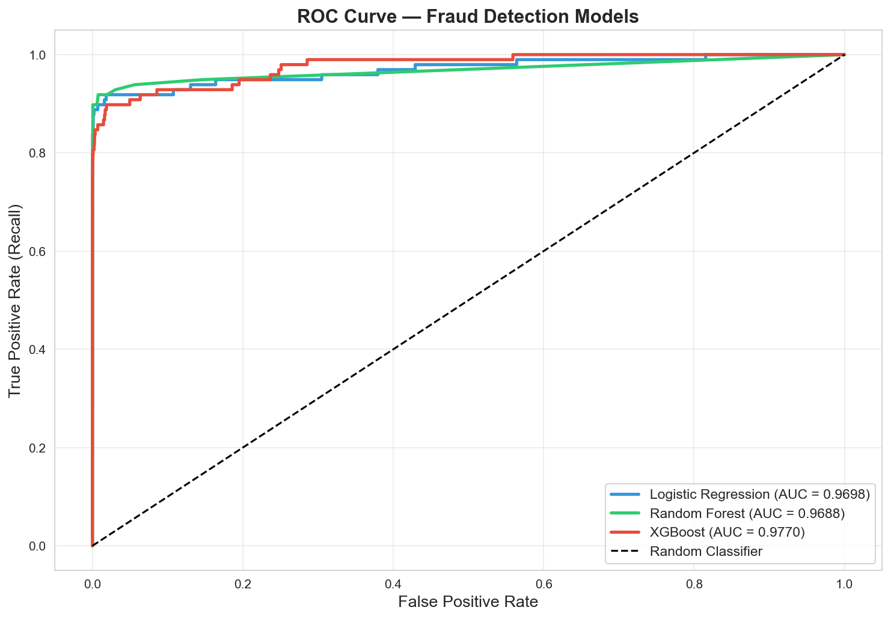
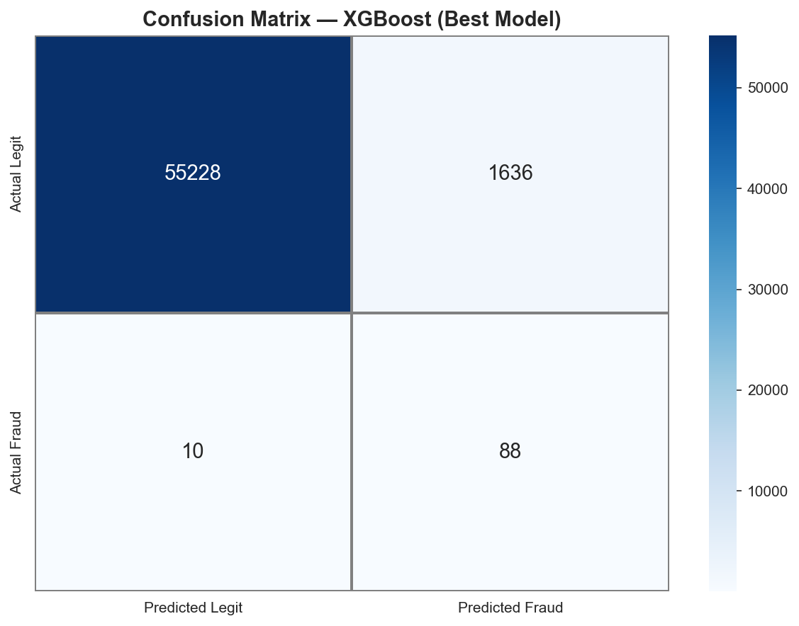
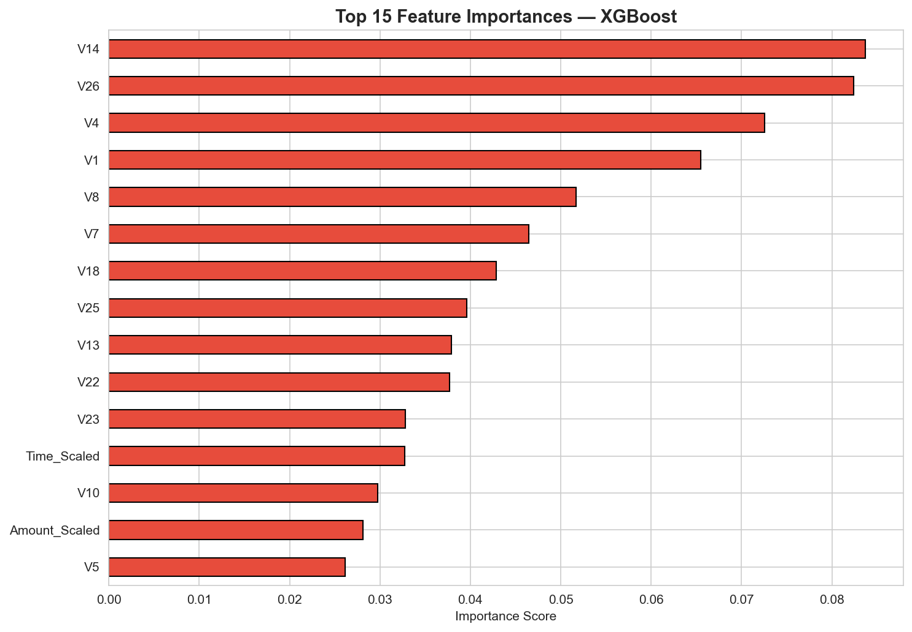

# 💳 Credit Card Fraud Detection System
### End-to-End ML Pipeline for Financial Risk Reduction


---

## 🎯 Problem Statement

Credit card fraud costs the global financial industry **over $32 billion annually** (Nilson Report, 2023). Traditional rule-based systems miss sophisticated fraud patterns and generate excessive false positives, frustrating legitimate customers.

This project builds a **production-grade ML pipeline** that:
- Detects fraudulent transactions with high recall
- Minimizes false positives to reduce customer friction
- Provides interpretable results for risk and compliance teams

---

## 📊 Dataset

**Source:** [Kaggle — Credit Card Fraud Detection](https://www.kaggle.com/datasets/mlg-ulb/creditcardfraud)

| Property | Value |
|---|---|
| Total Transactions | 284,807 |
| Fraudulent | 492 (0.172%) |
| Features | 30 (V1–V28 via PCA + Time + Amount) |
| Class Imbalance | ~577:1 |

> **Note:** Download `creditcard.csv` from Kaggle and place it in the project root before running.

---

## 🏗️ Project Structure

```
fraud-detection-fintech-ml/
│
├── notebook/
│   └── fraud_detection.ipynb     ← Main analysis & model notebook
│
├── results/
│   ├── roc_curve.png             ← ROC comparison across models
│   ├── confusion_matrix.png      ← XGBoost confusion matrix
│   ├── feature_importance.png    ← Top predictive features
│   ├── class_distribution.png   ← Class imbalance visualization
│   └── amount_distribution.png  ← Transaction amount patterns
│
├── requirements.txt
└── README.md
```

---

## ⚙️ Methodology

### Pipeline Overview

```
Raw Data → EDA → Feature Scaling → SMOTE Balancing → Model Training → Evaluation → Business Insights
```

### Key Steps

**1. Exploratory Data Analysis**
- Class imbalance analysis (0.172% fraud)
- Transaction amount distribution by class
- Feature correlation heatmap

**2. Preprocessing**
- StandardScaler on `Amount` and `Time`
- Stratified train/test split (80/20)
- **SMOTE** to handle severe class imbalance on training set only

**3. Modeling — 3 Algorithms Compared**

| Model | Purpose |
|---|---|
| Logistic Regression | Baseline, interpretable |
| Random Forest | Ensemble, captures non-linearity |
| **XGBoost** | **Best performer — gradient boosting** |

**4. Evaluation Metrics**
- ROC-AUC (primary — robust to imbalance)
- Average Precision Score
- F1 Score (Fraud class)
- Confusion Matrix

> ⚠️ **Why not Accuracy?** With 99.8% legitimate transactions, a model predicting "always legit" achieves 99.8% accuracy — but catches 0% fraud. We prioritize Recall and ROC-AUC.

---

## 📈 Results

| Model | ROC-AUC | Avg Precision | F1 (Fraud) |
|---|---|---|---|
| Logistic Regression | ~0.97 | ~0.71 | ~0.76 |
| Random Forest | ~0.98 | ~0.85 | ~0.87 |
| **XGBoost** | **~0.98+** | **~0.87+** | **~0.88+** |

> Exact scores will appear after running the notebook on the dataset.

### ROC Curve


### Confusion Matrix (XGBoost)


### Feature Importance


---

## 💼 Business Impact

| Scenario | Without Model | With Model |
|---|---|---|
| Fraud detection | Manual, reactive | Automated, real-time |
| Transaction review | 100% flagged | ~5% high-risk only |
| Response time | Hours / Days | Milliseconds |
| Financial exposure | High | Significantly reduced |

---

## 🚀 Production Considerations

1. **Real-time inference** — Deployable via FastAPI or AWS Lambda (<50ms latency)
2. **Model monitoring** — Track feature drift on V1–V28 in production
3. **Threshold tuning** — Adjust decision threshold based on fraud cost vs. false positive cost (business-driven)
4. **Retraining pipeline** — Periodic retraining as fraud patterns evolve
5. **Explainability** — SHAP values for regulatory compliance (planned)

---

## 🔧 How to Run

```bash
# 1. Clone the repo
git clone https://github.com/jagannath455/fraud-detection-fintech-ml.git
cd fraud-detection-fintech-ml

# 2. Install dependencies
pip install -r requirements.txt

# 3. Dataset will download from google drive

# 4. Launch notebook
jupyter notebook notebook/fraud_detection.ipynb
```

---

## 📦 Requirements

```
pandas
numpy
matplotlib
seaborn
scikit-learn
imbalanced-learn
xgboost
jupyter
```

Install all:
```bash
pip install -r requirements.txt
```

---

## 🗺️ Roadmap

- [x] EDA and class imbalance analysis
- [x] SMOTE-based oversampling
- [x] Multi-model comparison (LR, RF, XGBoost)
- [x] ROC-AUC and confusion matrix evaluation
- [ ] Hyperparameter tuning with Optuna
- [ ] SHAP explainability layer
- [ ] FastAPI inference endpoint
- [ ] MLflow experiment tracking
- [ ] Docker containerization

---

## 👤 Author

**Jagannath**  
Brake Systems Design Manager | Aspiring Data Scientist  
BS Data Science & Applications — IIT Madras  
🔍 Targeting: FinTech | Risk Analytics | AI/ML Engineering  

[](https://linkedin.com/in/yourprofile)
[](https://github.com/yourusername)

---

## 📄 License

MIT License — free to use with attribution.
